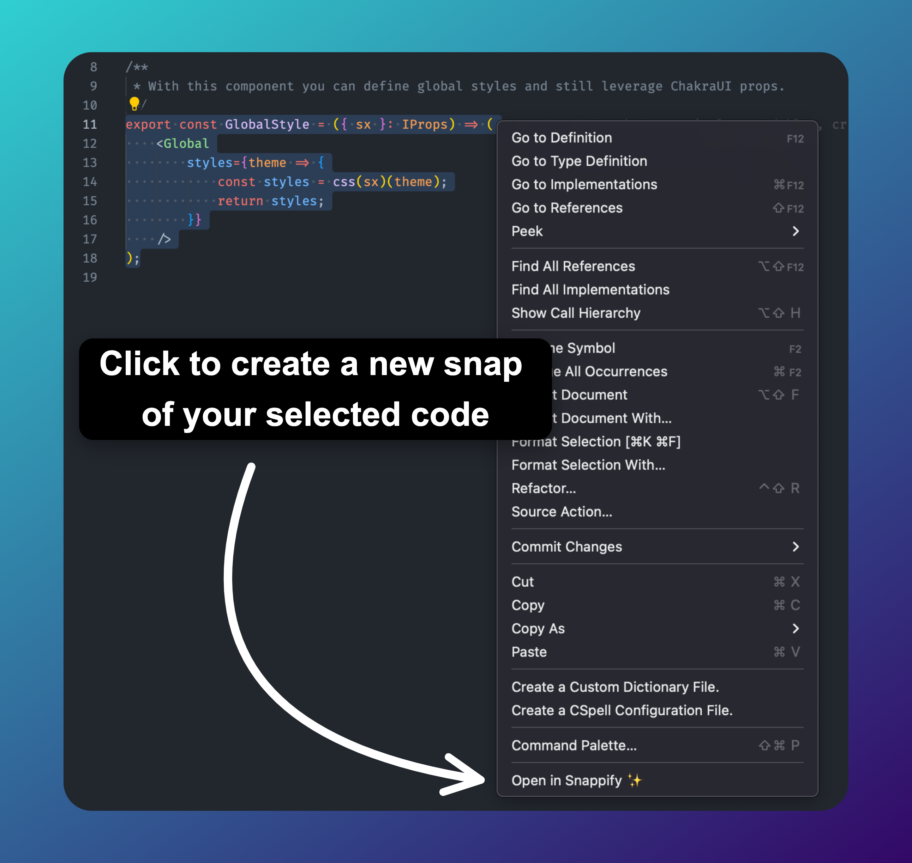
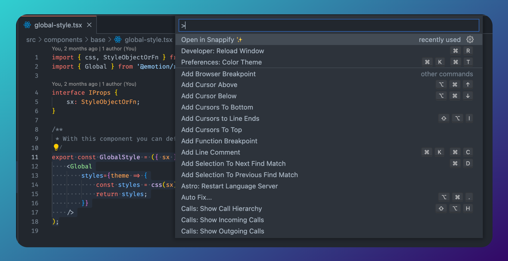

# snappify

snappify is the place for beautiful code snippets. Easily explain your code and share your knwowledge with the rest of the world.

And using this VS Code extension it's even simpler for create stunning images of your code.

# Extension Usage

## Context Menu

Using the extension is as easy as selecting the desired code and right-click -> "Open in Snappify ✨". This will lead you directly to snappify where a new snap is being created using the code you've selected.

Afterwards you can edit the snap to your wishes with the powerful snappify Editor.

## Command Palette

Alternatively you can also selected the desired code and execute the command via the Command Palette (Ctrl+Shift+P on Windows and Linux, Cmd+Shift+P on OS X).

# Features

Head over to [snappify.io](https://snappify.io/) to learn more about available options to explain your code.

You have many options like adding arrow elements, code highlights or custom images to truly explain how your code / features work.

If you're missing anything, don't hesitate to reach out to us via [info@snappify.io](mailto:info@snappify.io)
